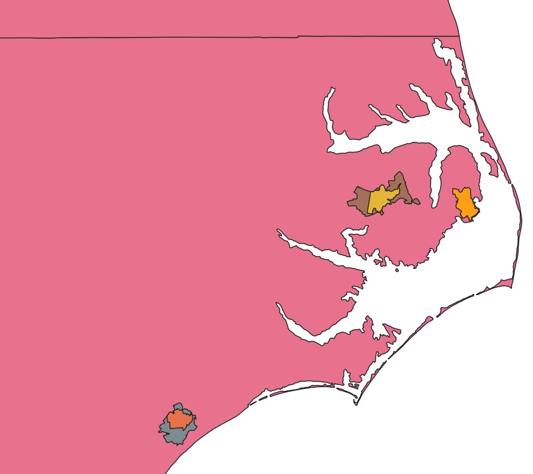

# Lab 6 - Bivariate Map.

#### Introduction
The Purpose of this lab was to create a map that displayed some kind of data in point format and in polygon format. I chose to make a map that focused on fire in various parts of NC as well as a concentrated focus on Chapel Hill. 
#### Major Functions
The major functions the map were supposed to be a function where you could click on a data point and see the address of where the fire happened for Chapel Hill. For polygons, the function was a legend that told you what kind of fire they were (as in controlled, wildfire, ect.). I couldn't figure out how to make either of the geojsons load on the map, so these features are not working.

This is what the fire polygons were supposed to look like, roughly: 
image screenshot from QGIS showing ENC and some colored fire areas

#### Libraries and Data Sources
Leaflet, geojson.io, data.gov, MTBS.gov .

